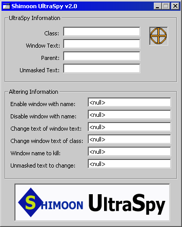

## UltraSpy 2\.0 \- PLEASE VOTE

### Description

UPDATE: REAVEALS 

----

MASKED TEXT - PLEASE VOTE

Move mouse pointer over objects and UltraSpy returns info. Returns: Class, Window Text, Parent, and Unmasked Text. With the required info, you can enable windows, disable windows, change text by window text, change text by class, change text my unmasked value, and close windows by text. This code is a great way to learn API. If you vote, I will continue to make it better. Thank you. Armen Shimoon
 
### More Info
 

             |
---                |---
**Submitted On**   |2001-05-14 22:43:22
**By**             |[Armen Shimoon](https://github.com/Planet-Source-Code/PSCIndex/blob/master/ByAuthor/armen-shimoon.md)
**Level**          |Intermediate
**User Rating**    |4.9 (68 globes from 14 users)
**Compatibility**  |VB 6\.0
**Category**       |[Windows API Call/ Explanation](https://github.com/Planet-Source-Code/PSCIndex/blob/master/ByCategory/windows-api-call-explanation__1-39.md)
**World**          |[Visual Basic](https://github.com/Planet-Source-Code/PSCIndex/blob/master/ByWorld/visual-basic.md)
**Archive File**   |[UltraSpy 2196515152001\.zip](https://github.com/Planet-Source-Code/armen-shimoon-ultraspy-2-0-please-vote__1-23201/archive/master.zip)

